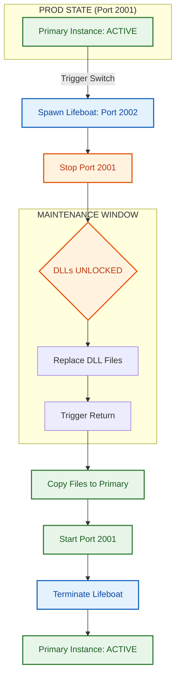

# .NET Blue-Green Deployment Master Controller

A production-ready deployment strategy for ASP.NET Core that solves the .NET DLL file-locking issue using Nginx and a "Bounce" deployment flow.

## Operational Flow

---

## The Problem: DLL Locking
In traditional .NET deployments, the runtime locks `.dll` files while the application is running. If you try to overwrite these files during an update, the deployment fails. If you stop the service to overwrite them, your website goes down.

## The Solution: Blue-Green "Bounce"
This system solves the issue by using a reverse proxy (Nginx) to shift traffic between two ports:
1.  **Green (2001)**: The primary production port.
2.  **Blue (2002)**: The temporary failover port.

**How it prevents downtime:**
*   **Traffic Shifting**: Before updating, we start a "Blue" instance and tell Nginx to send all users there.
*   **Safe Unlocking**: We then stop the "Green" service. Since no traffic is hitting it, the DLLs are released and can be replaced safely.
*   **Zero-Downtime Return**: Once updated, we restart "Green" and switch Nginx back. Users never see an error page.

---

## Project Structure
*   `src/` — ASP.NET Core source code with integrated switch logic.
*   `scripts/` — Bash automation for Linux deployment.
*   `nginx/` — Nginx reverse proxy configuration.
*   `www/` — Environment folders (green/blue) for local proof.
*   `publish/` — Staging area for build artifacts.
